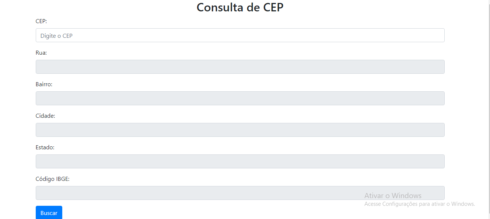

## Consulta de CEP com API 
Esse projeto consiste em uma página web que permite aos usuários realizar consultas de CEP para obter informações de endereço. 

    

## Estrutura HTML:
A página possui um formulário com um campo de entrada para o CEP e campos de texto para exibir informações de endereço como rua, bairro, cidade, estado e código IBGE.
Há um botão "Buscar" que quando clicado chama a função consultaCEP(). 

## Estilo:
O projeto utiliza o framework Bootstrap para estilizar os elementos HTML.

## Script JavaScript:
consultaCEP(): Esta função é chamada quando o botão "Buscar" é clicado. Ela pega o valor do CEP digitado, remove quaisquer caracteres não numéricos, e verifica se o campo não está vazio. Se o CEP for válido (composto por 8 dígitos numéricos), é criado um script dinâmico apontando para a API do ViaCEP com o CEP informado, para obter os dados de endereço em formato JSON. Essa resposta é tratada pela função preencheFormulario(). Se o CEP não for válido, exibe um alerta informando ao usuário.

preencheFormulario(conteudo): Esta função é chamada quando a resposta da consulta é recebida. Verifica se não há erro na resposta. Se não houver erro, preenche os campos de rua, bairro, cidade, estado e código IBGE com os dados recebidos. Se houver erro, exibe um alerta informando ao usuário que o CEP não foi encontrado.

limpaFormulario(): Esta função é responsável por limpar os campos de rua, bairro, cidade, estado e código IBGE do formulário.

  
  
  
  

